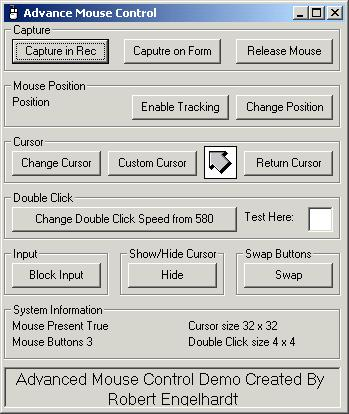



## Advanced Mouse Control OCX 1\.0

### Description

This project gives the user control to many mouse specific controls (including API) in an easy to use OCX. This can also be used as a sample active x control.

This project gives access to things such as:

Capturing Mouse

Coordinate Tracking

Cursor Changing

Double Click speed information/ changing

Input blocking

Cursor Displaying/Hiding

Mouse Button Swapping

Mouse Button count

Cursor position changing

And other miscellaneous information
 
### More Info
 
See code it explains it all

see then code and all shall be explained grashopper.

none known at this time

             |
---                |---
**Submitted On**   |2001-08-08 15:16:06
**By**             |[Robert 'Bob' Engelhardt](https://github.com/Planet-Source-Code/PSCIndex/blob/master/ByAuthor/robert-bob-engelhardt.md)
**Level**          |Intermediate
**User Rating**    |5.0 (60 globes from 12 users)
**Compatibility**  |VB 5\.0, VB 6\.0
**Category**       |[Custom Controls/ Forms/  Menus](https://github.com/Planet-Source-Code/PSCIndex/blob/master/ByCategory/custom-controls-forms-menus__1-4.md)
**World**          |[Visual Basic](https://github.com/Planet-Source-Code/PSCIndex/blob/master/ByWorld/visual-basic.md)
**Archive File**   |[Advanced M24294882001\.zip](https://github.com/Planet-Source-Code/robert-bob-engelhardt-advanced-mouse-control-ocx-1-0__1-25996/archive/master.zip)

### API Declarations

All declared in project

